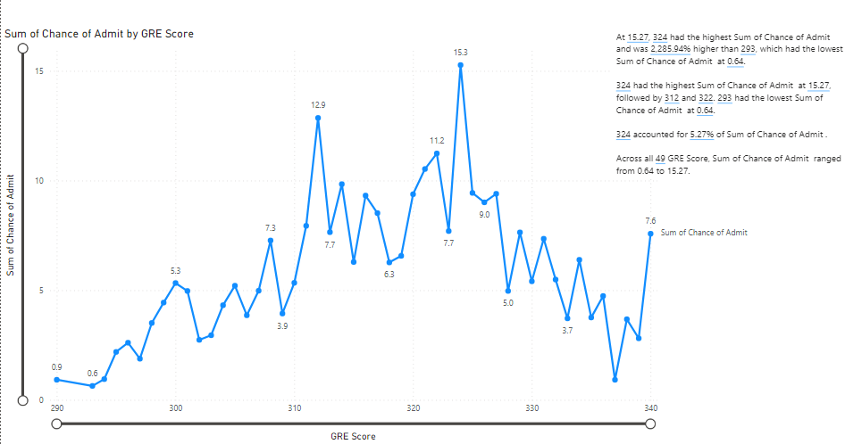
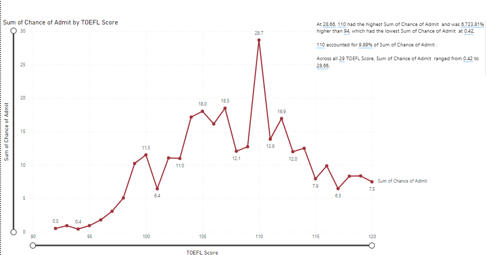
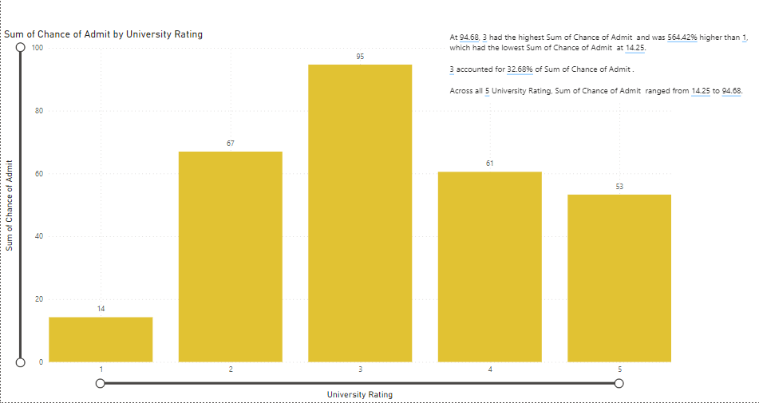
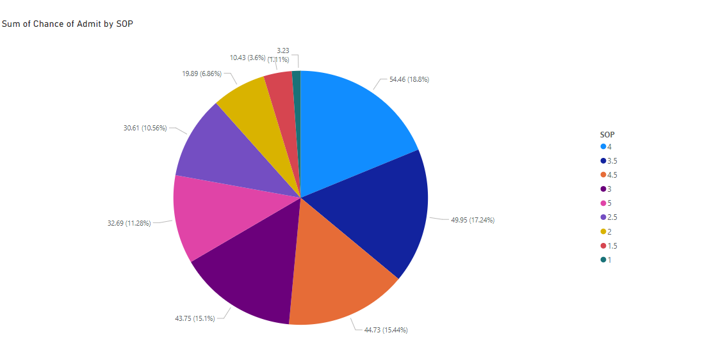
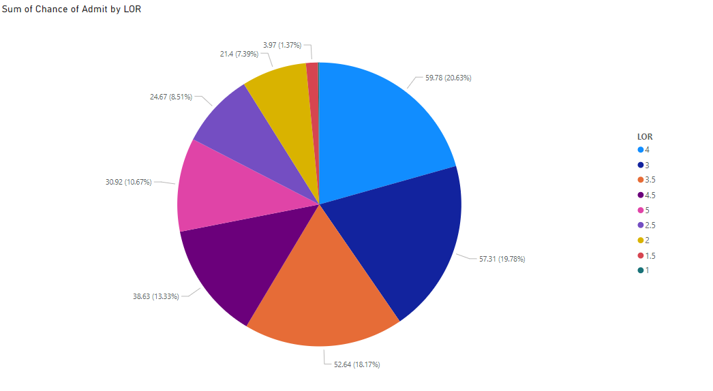
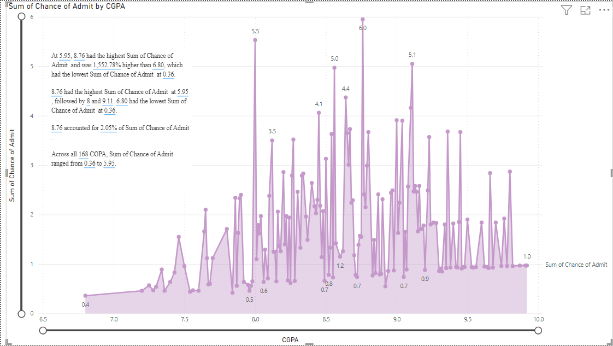
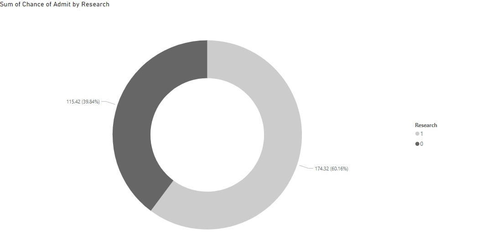

# Graduate-Admission
In this Machine Learning application, the user can predict his/her admission in graduation providing their respective GRE Score, TOEFL Score,University Rating, SOP, LOR, CGPA, and Research(if any).
The procedure of this model begins with
- Collecting the dataset
- Reading the dataset i.e csv file
- Segregating the input and output variables
- Splitting the data into training and testing sets
- Creating a Logistic Regression model and fitting the data into it
- Lastly, depicting score of the model and plotting the confusion matrix to find anomalies

Technologies Used:
- Python : Machine Learning algorithm i.e Logistic Regression
- Streamlit : To develop the user interface and deploy the model into web-app
- Power BI : To demonstrate how various attributes are affecting the chance of admission of a student in graduation
  
Check out this model deployed by streamlit here : https://graduate-admission-predictor-byaarathi1535.streamlit.app/

Relation between GRE Score and Chance of Admit:-

Relation between TOFEL Score and Chance of Admit:-

Relation between University Rating and Chance of Admit:-

Relation between SOP and Chance of Admit:-

Relation between LOR and Chance of Admit:-

Relation between CGPA and Chance of Admit:-

Relation between Research and Chance of Admit:-

