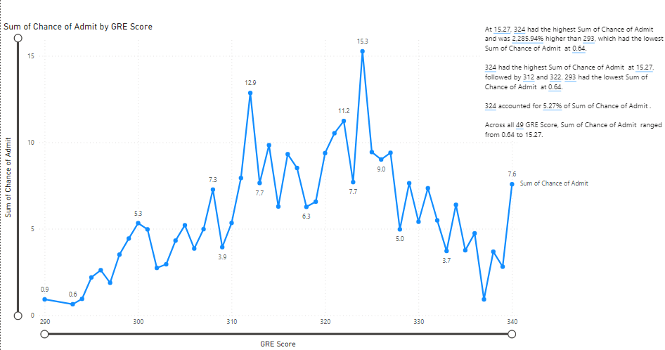
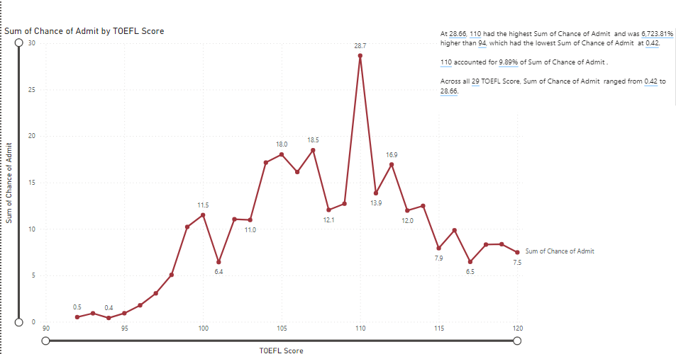
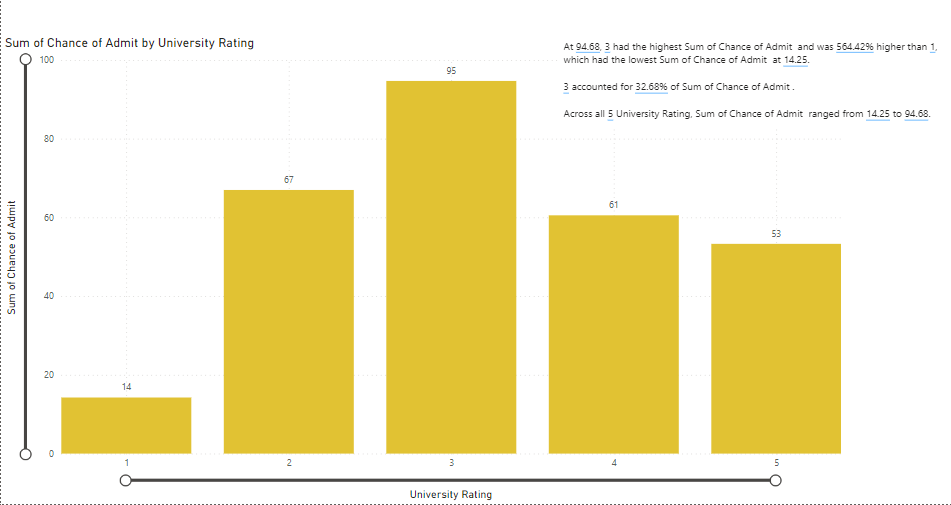
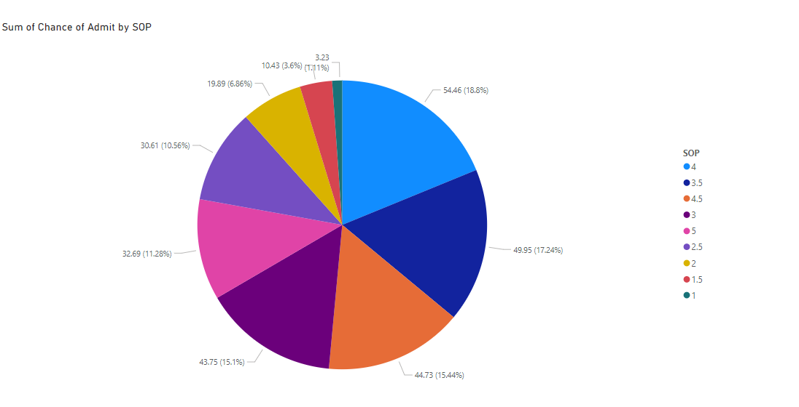
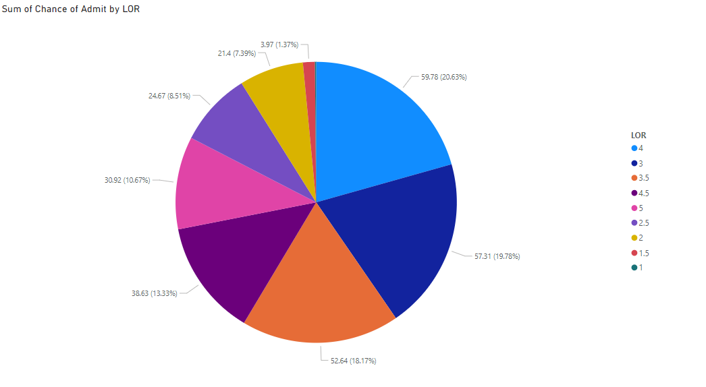
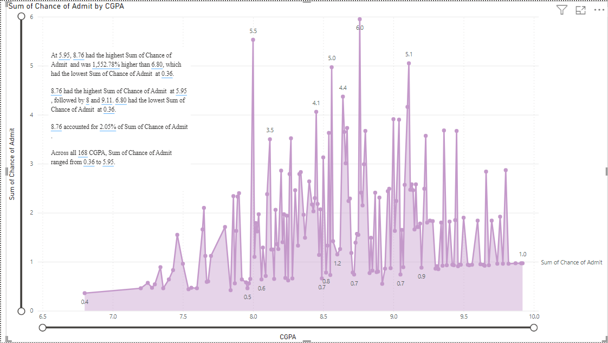
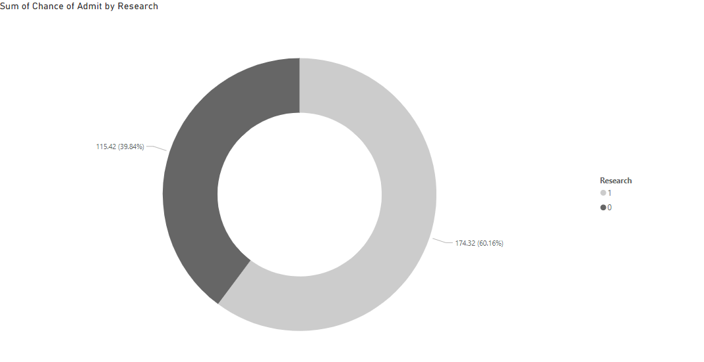

# 🎓 **Graduate Admission Predictor** 🚀

Ever wondered if you have what it takes to get into your dream graduate program? 🤔 This Machine Learning-powered web application lets you predict your chances of admission based on key academic and personal data like your GRE score, TOEFL score, CGPA, and more! It's like having a personalized admission counselor right at your fingertips. 🌟

## 📝 **Features:**
- **Admission Prediction**: Enter your details (GRE, TOEFL, CGPA, and others) to predict your chances of getting admitted to a graduate program. 📊
- **Data Visualization**: Explore how various factors like your GRE score, University rating, and Research experience influence your admission chances through interactive graphs. 📉
- **User-Friendly Interface**: Built using **Streamlit**, this web app makes it super easy for anyone to get predictions in a few clicks. 🖱️
  
## 🚀 **How It Works:**
This web app uses a **Logistic Regression** model trained on real data to predict your chances. Here's the process:

1. **Data Collection**: We collect data on past applicants, including their GRE scores, TOEFL scores, CGPA, University ratings, SOP, LOR, and Research experience.
2. **Data Preprocessing**: The dataset is read and organized into input (features) and output (target) variables.
3. **Model Training**: We split the data into training and testing sets, then build and train a **Logistic Regression** model.
4. **Model Evaluation**: Once trained, we evaluate the model's performance and check for any misclassifications using a confusion matrix. 🔍
5. **Prediction Time**: Once everything is set up, we deploy the model on a **Streamlit** web app, where you can enter your details and get your admission chances! 🎯

## 🔧 **Technologies Used**:
- **Python**: The heart of the machine learning magic—using **Logistic Regression** to predict your admission chances. 💻
- **Streamlit**: A fast and interactive web framework to create and deploy the model interface. 🚀
- **Power BI**: Visualizations to show how your scores, SOP, and other attributes affect your chances of admission. 📊
- **Pandas & Scikit-learn**: For data handling, model training, and evaluation. 🔧

## 🎉 **How to Use**:
1. **Check it out online**: Visit our [Graduate Admission Predictor Web App](https://graduate-admission-predictor-byaarathi1535.streamlit.app/) and see the magic happen!
2. **Enter your data**: Fill out the form with your GRE score, TOEFL score, University Rating, SOP, LOR, CGPA, and Research experience.
3. **Get your prediction**: Find out your chances of getting admitted and make informed decisions for your graduate journey! 🎓

## 🔍 **Explore the Data**:
Curious about how different factors influence admission chances? We’ve got you covered with these insightful visualizations:

- **GRE Score vs. Chance of Admit**: 📈 See how your GRE score stacks up against admission odds.
  

- **TOEFL Score vs. Chance of Admit**: 🌍 How your TOEFL performance could change your chances.
  

- **University Rating vs. Chance of Admit**: 🏫 Is a top-rated university a game changer? Let's find out!
  

- **SOP vs. Chance of Admit**: ✍️ How much weight does your Statement of Purpose carry?
  

- **LOR vs. Chance of Admit**: 📜 The importance of your Letter of Recommendation.
  

- **CGPA vs. Chance of Admit**: 📚 Does your academic performance make the cut? Let's see.
  

- **Research vs. Chance of Admit**: 🔬 Does having research experience boost your chances?
  

## ⚙️ **Installation & Setup**:
1. Clone the repository:
   ```bash
   git clone https://github.com/Aarathi1535/Graduate-Admission.git
   ```
